# Lucienne: Quest for Quality Education — UML Design Document

**Course:** TMF2954 Java Programming
**Theme:** SDG 4 — Quality Education

This document contains the Unified Modelling Language (UML) diagrams explaining the
structure of the project's classes and interfaces, plus the class/interface
distribution for all project members.

The diagrams are written in **PlantUML** text format. To render them as images:
- Paste the code blocks into https://www.plantuml.com/plantuml
- Or use the "PlantUML" extension in VS Code (Alt+D to preview)

---

## 1. Class / Interface Distribution (by team member)

| Member | Module | Classes | Interface |
|--------|--------|---------|-----------|
| **Aezekiel** (Leader) | Player + open-world map + integration | `Player`, `GamePanel`, `Entity`, `KeyHandler`, `Main`, `AssetSetter`, `EventHandler`, `CollisionChecker`, `UI`, `UtilityTool`, `Sound`, `Tile`, `TileManager` | `Playable` |
| **Lee Yun Zhan** | Learning + NPC interaction | `LearningPage`, `LearningManager`, `NPC_Piercehardt`, `NPC_Villager`, `NPC_Shopkeeper`, `NPC_KingLuin`, `NPC_Lucious`, `NPC_SheenaMemory` | `Interactable`, `Learnable` |
| **Nathanael** | Quiz + battle system | `Question`, `MultipleChoiceQuestion`, `TrueFalseQuestion`, `FillBlankQuestion`, `QuizManager`, `MON_MemoryFragment`, `BOSS_Shona`, `InvalidAnswerException` | `QuizPlayable` |
| **Habib** | Score + progress + endings | `ScoreStorage`, `GameProgress`, `EndingManager`, `Badge`, `LockedAreaException`, `ScoreFileException`, `OBJ_KnowledgeScroll`, `OBJ_KnowledgePotion`, `OBJ_ManaPotion`, `OBJ_MemoryCharm` | `Storable`, `Rewardable` |

**Testing pairs:** Aezekiel→Lee, Lee→Nathanael, Nathanael→Habib, Habib→Aezekiel

---

## 2. Overall Package Diagram

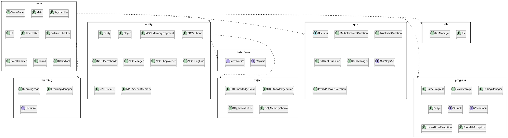

---

## 3. Entity Inheritance Hierarchy (Aezekiel + Lee + Nathanael + Habib)

This is the core inheritance tree. Every game object extends `Entity`.

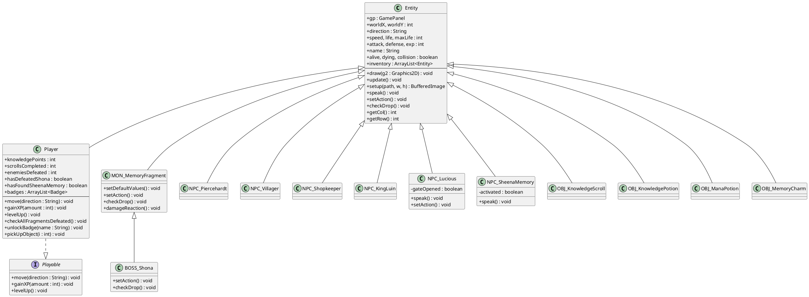

---

## 4. Quiz System Diagram (Nathanael)

Demonstrates **abstraction** (`Question`), **inheritance** (3 subclasses),
**polymorphism** (`checkAnswer` overridden), and the **`QuizPlayable`** interface.

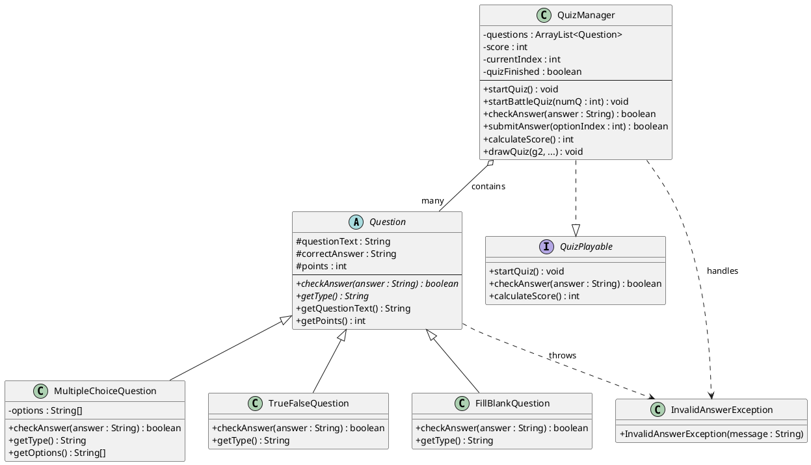

---

## 5. Learning System Diagram (Lee Yun Zhan)

Demonstrates the **`Learnable`** interface, **method overloading**
(`displayPage(int)` and `displayPage(String)`), and **ArrayList** usage.

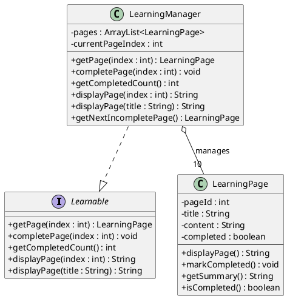

---

## 6. NPC Interaction Diagram (Lee Yun Zhan)

NPCs extend `Entity` and override `speak()` for dialogue (polymorphism).
The **`Interactable`** interface defines the interaction contract for the module.

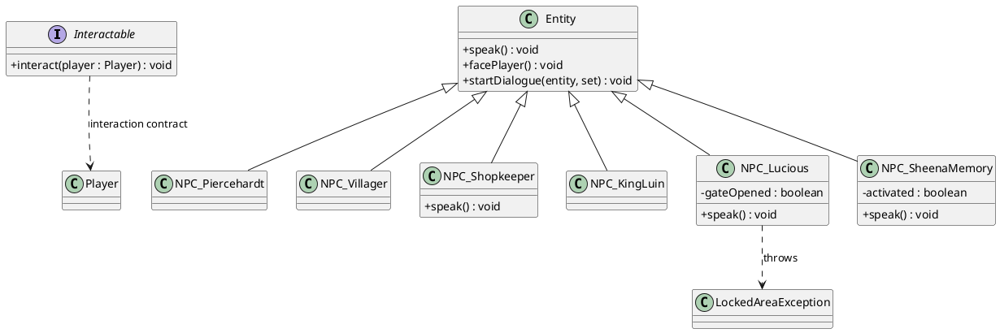

> Note: NPC dialogue is handled through the inherited `Entity.speak()` method
> (runtime polymorphism). The `Interactable` interface documents the interaction
> contract for the NPC module.

---

## 7. Progress / Score / Endings Diagram (Habib)

Demonstrates **`Storable`** and **`Rewardable`** interfaces, **file I/O**,
and **custom exceptions**.

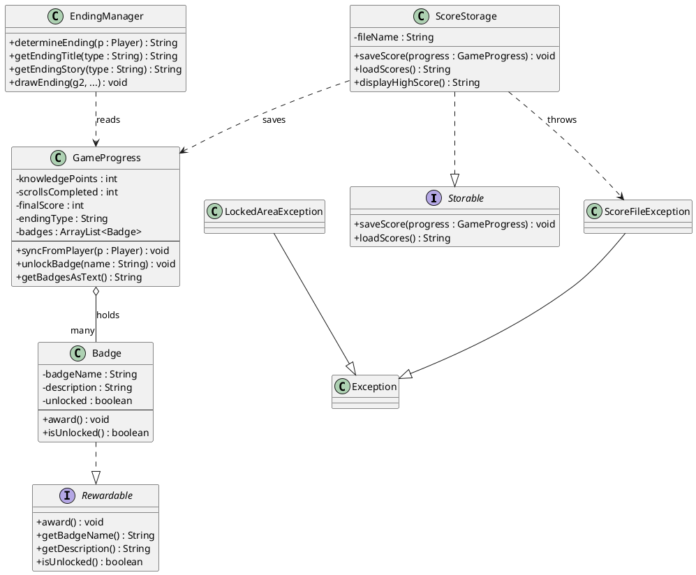

---

## 8. Core Engine / Integration Diagram (Aezekiel)

Shows how `GamePanel` (the controller) wires all subsystems together —
this is the **integration** module.

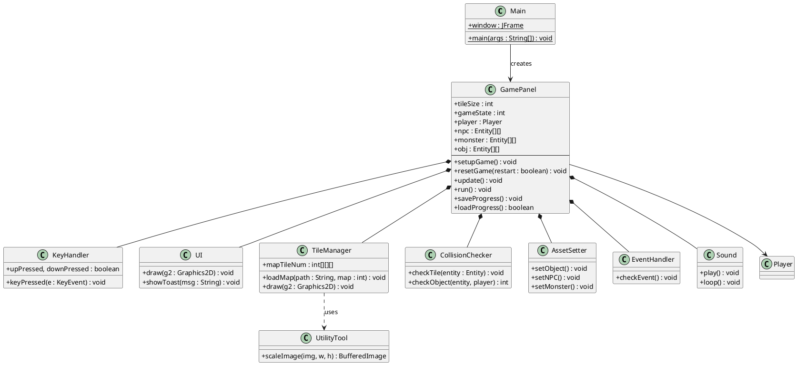

---

## 9. Game State Machine Diagram

The game uses a **state machine** managed by `GamePanel.gameState`.
Below is the state transition flow.

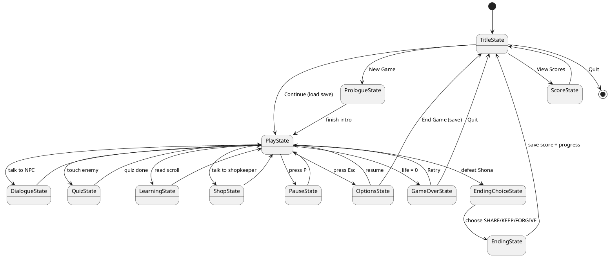

---

## 10. Use Case Diagram (Player Actions)

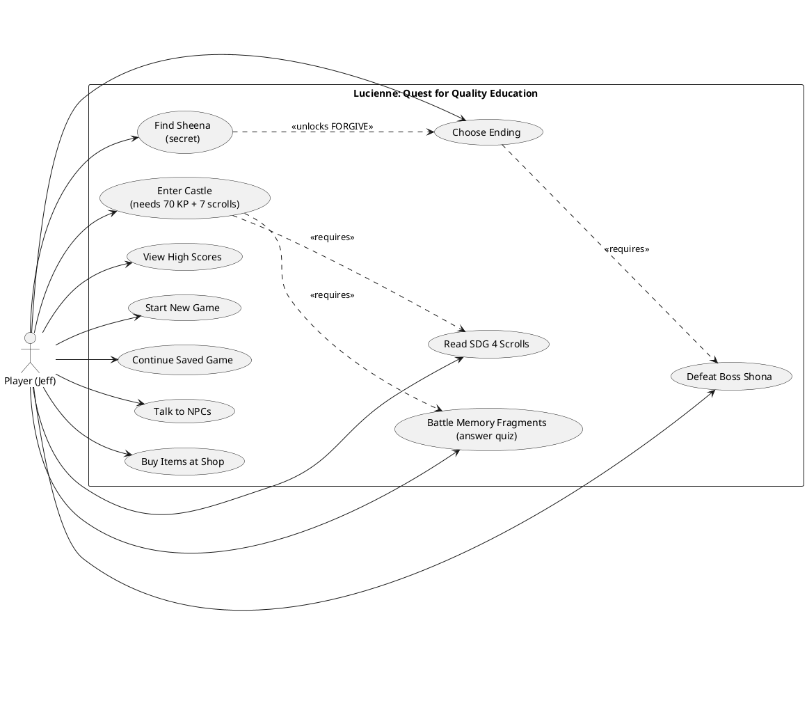

---

## 11. Sequence Diagram — Quiz Battle Flow (Nathanael's module)

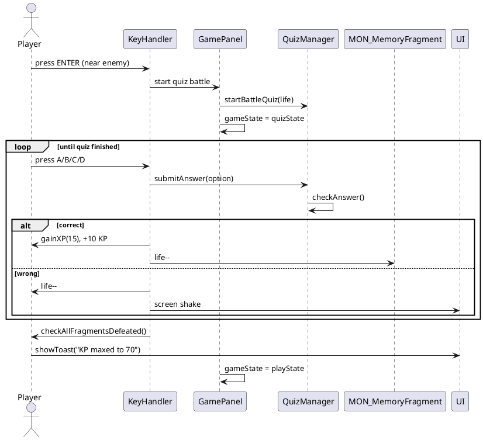

---

## 12. Sequence Diagram — Castle Gate Unlock (Lee + Aezekiel)

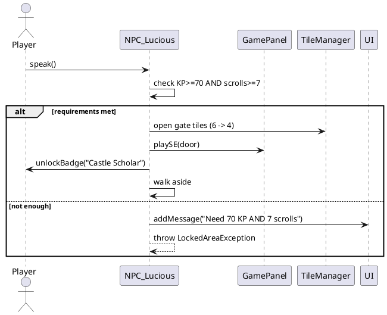

---

## Notes on OOP Concepts Demonstrated

| Concept | Where |
|---------|-------|
| **Inheritance** | `Entity` → Player/NPCs/Monsters/Objects; `Question` → MC/TF/Fill; `MON_MemoryFragment` → `BOSS_Shona` |
| **Abstraction** | abstract class `Question`; base class `Entity` |
| **Polymorphism** | `checkAnswer()`, `speak()`, `setAction()`, `checkDrop()` overridden per subclass |
| **Encapsulation** | private fields + getters/setters in `Badge`, `GameProgress`, `LearningPage`, `Question` |
| **Interfaces** | `Playable`, `Interactable`, `Learnable`, `QuizPlayable`, `Storable`, `Rewardable` |
| **Exception Handling** | `LockedAreaException`, `InvalidAnswerException`, `ScoreFileException` |
| **File I/O** | `ScoreStorage` (scores.txt), `GamePanel.saveProgress/loadProgress` (progress.dat) |
| **Collections** | `ArrayList` for badges, inventory, questions, learning pages, entities |
| **Method Overloading** | `LearningManager.displayPage(int)` / `displayPage(String)`; `Player.gainXP(int)` / `gainXP(int, String)` |
